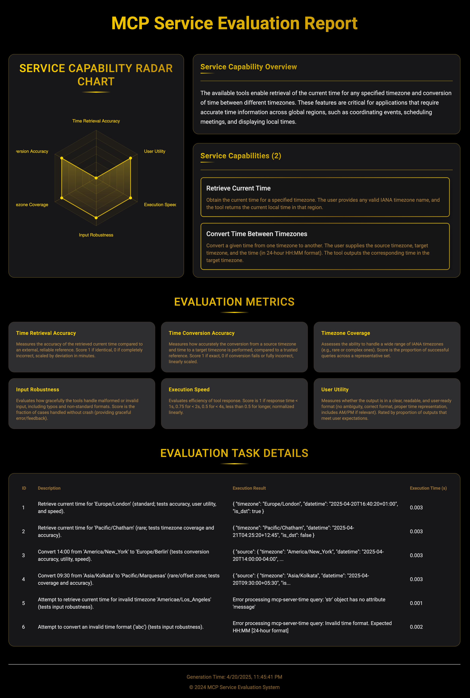

# Vibe Evaluator MVP

## Overview (English)

This directory contains a Minimum Viable Product (MVP) implementation of the Vibe Evaluator concept, implemented using the [smolagents](https://huggingface.co/docs/smolagents/en/index) framework. It provides a simplified yet functional demonstration of the core idea: evaluating AI agents through their standardized capability descriptions.

The evaluation process is now consolidated into the `agent_evaluator.py` script, which supports two modes:

1.  **Introspection Mode (`--mode introspect`)**: The agent evaluates its own capabilities based on the tools provided by an MCP server. It defines metrics, designs tasks, executes them, and generates a self-assessment report.
2.  **Interview Mode (`--mode interview`)**: An "interviewer" agent assesses a "candidate" agent (which uses the MCP tools). The interviewer asks questions, assigns tasks, and evaluates the candidate's performance, producing an interview report.

## Usage

The script requires the `--mode` argument to specify the evaluation type.

```bash
# Introspection Mode with default time server (stdio)
python agent_evaluator.py --mode introspect --server-type stdio --server-params "uvx mcp-server-time --local-timezone=America/New_York"

# Interview Mode with default time server (stdio)
python agent_evaluator.py --mode interview --server-type stdio --server-params "uvx mcp-server-time --local-timezone=America/New_York"

# Using an SSE server (Introspection example)
python agent_evaluator.py --mode introspect --server-type sse --server-params "https://example.com/mcp-endpoint"

# Output format options (Interview example)
python agent_evaluator.py --mode interview --server-type stdio --server-params "uvx mcp-server-time --local-timezone=America/New_York" --output json
python agent_evaluator.py --mode interview --server-type stdio --server-params "uvx mcp-server-time --local-timezone=America/New_York" --output yaml
python agent_evaluator.py --mode interview --server-type stdio --server-params "uvx mcp-server-time --local-timezone=America/New_York" --output html
```

## Report Example

Below is an example of the generated HTML report (this example is from the introspection mode):



---

## 概述 (中文)

此目录包含 Vibe Evaluator 概念的最小可行产品 (MVP) 实现，使用 [smolagents](https://huggingface.co/docs/smolagents/en/index) 框架实现。它提供了核心理念的简化但功能完整的演示：通过标准化能力描述评估 AI 代理。

评估过程现已合并到 `agent_evaluator.py` 脚本中，支持两种模式：

1.  **内省模式 (`--mode introspect`)**: 代理根据 MCP 服务器提供的工具评估自身能力。它定义指标、设计任务、执行任务并生成自我评估报告。
2.  **面试模式 (`--mode interview`)**: 一个"面试官"代理评估一个"候选人"代理（该代理使用 MCP 工具）。面试官提出问题、分配任务并评估候选人的表现，生成面试报告。

## 使用方法

该脚本需要 `--mode` 参数来指定评估类型。

```bash
# 使用默认时间服务器的内省模式 (stdio)
python agent_evaluator.py --mode introspect --server-type stdio --server-params "uvx mcp-server-time --local-timezone=America/New_York"

# 使用默认时间服务器的面试模式 (stdio)
python agent_evaluator.py --mode interview --server-type stdio --server-params "uvx mcp-server-time --local-timezone=America/New_York"

# 使用 SSE 服务器（内省示例）
python agent_evaluator.py --mode introspect --server-type sse --server-params "https://example.com/mcp-endpoint"

# 输出格式选项（面试示例）
python agent_evaluator.py --mode interview --server-type stdio --server-params "uvx mcp-server-time --local-timezone=America/New_York" --output json
python agent_evaluator.py --mode interview --server-type stdio --server-params "uvx mcp-server-time --local-timezone=America/New_York" --output yaml
python agent_evaluator.py --mode interview --server-type stdio --server-params "uvx mcp-server-time --local-timezone=America/New_York" --output html
```

## 报告示例

以下是生成的 HTML 报告示例（此示例来自内省模式）：


